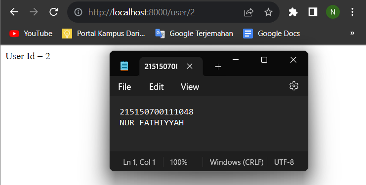
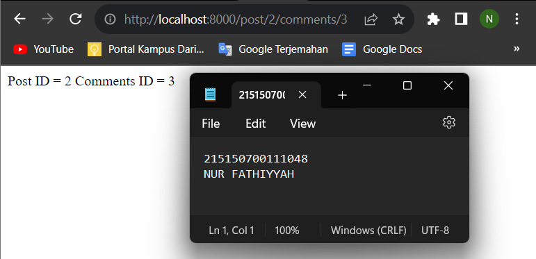
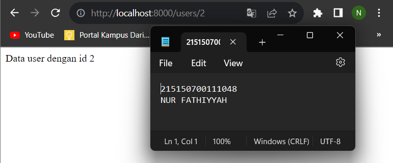
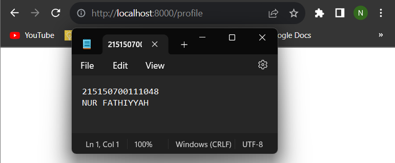

# Modul 5 - Dynamic Route dan Middleware

## Dynamic Route

- ### Langkah 1

  Menambahkan baris kode untuk dynamic routes seperti pada gambar
  

- ### Langkah 2

  Mengakses halaman web dari route yang telah dibuat sebelumnya
  
  

- ### Langkah 3

  Menambahkan paramater pada routes dengan baris kode seperti pada gambar
  

- ### Langkah 4

  Mengakses halaman web dari route dengan parameter variabel tambahan
  

- ### Langkah 5

  Menambahkan optional routes dengan kode baris seperti pada gambar
  

- ### Langkah 6

  Mengakses halaman web optional routes dengan parameter variabel dan tanpa parameter variabelnya
  
  

## Aliases Route

- ### Langkah 7

  Menambahkan aliases route dengan kode baris seperti pada gambar
  

- ### Langkah 8

  Mengakses halaman web /auth/login dan /profile
  
  

## Group Route

- ### Langkah 9

  Menambahkan group route dengan kode baris seperti pada gambar
  

- ### Langkah 10

  Mengakses halaman web /users yang menggunakan metode grouping
  

## Middleware

- ### Langkah 11

  Menyalin file `ExampleMiddleware` pada `app/Http/Middleware` dan mengubah nama file tersebut menjadi `AgeMiddleware`, kemudian memasukkan baris kode seperti pada gambar
  

- ### Langkah 12

  Mendaftarkan `AgeMiddleware` pada aplikasi di dalam file `bootstrap/app.php`
  

- ### Langkah 13

  Menambah route middleware dengan baris kode seperti pada gambar
  

- ### Langkah 14

  Mengakses halaman web /admin/home/ dan /fail. Halaman web /admin/home/ akan dialihkan menuju halaman web /fail karena tidak terdapat parameter umur pada route nya
  
