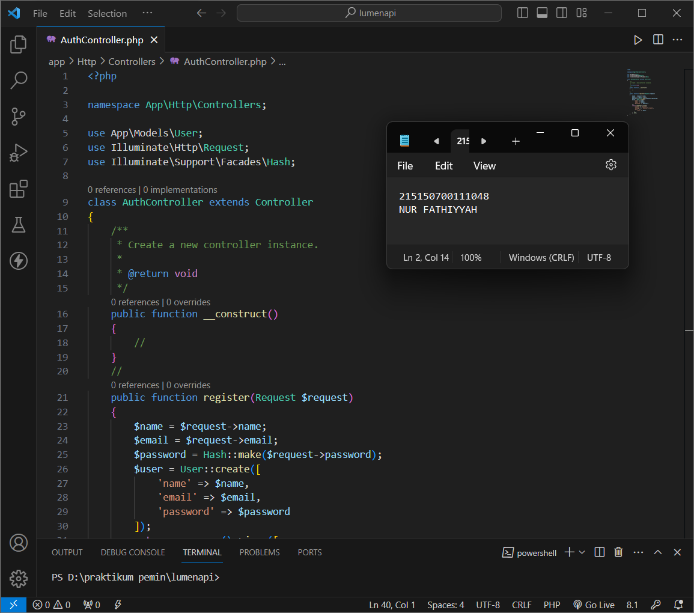
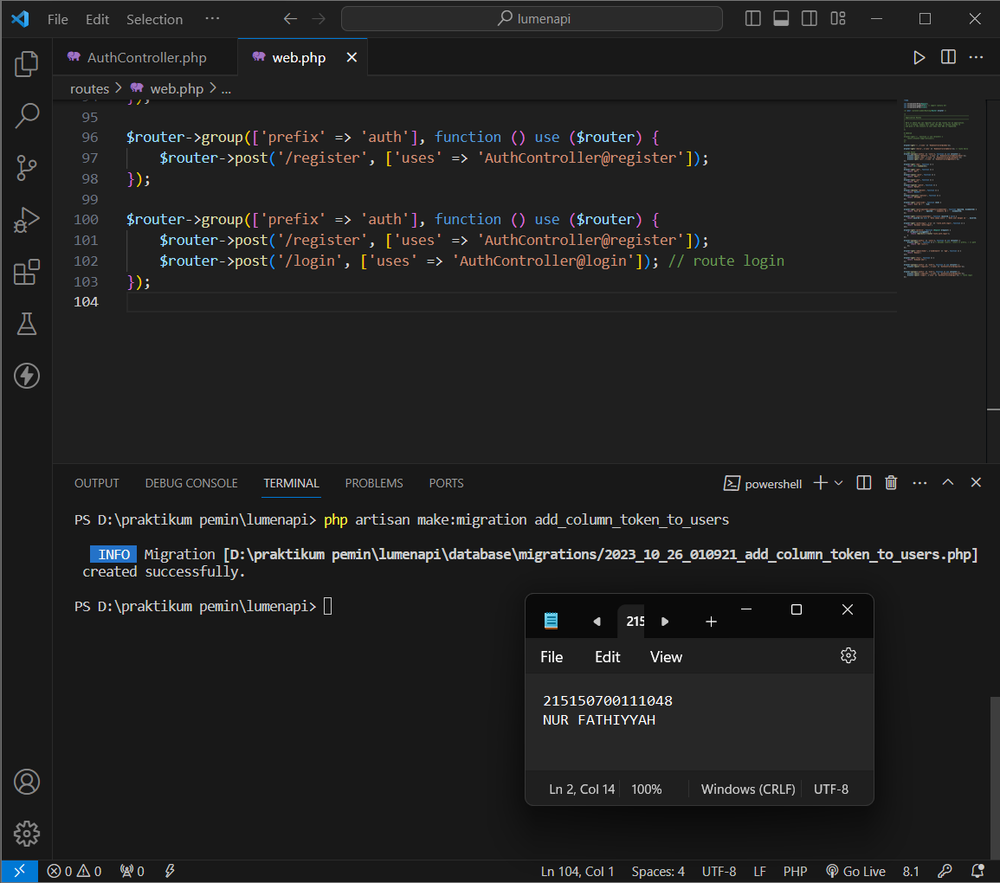

# Modul 7 - Register, Authentication dan Authorization

## Register

- ### Langkah 1

  Memastikan terdapat tabel users yang dibuat menggunakan migration pada praktikum 4 Basic Routing dan Migration
  

- ### Langkah 2

  Memastikan terdapat model User.php yang digunakan pada praktikum 6 Model, Controller dan Request-Response Handler
  

- ### Langkah 3

  Membuat file AuthController.php dan menambahkan baris kode seperti pada gambar
  

- ### Langkah 4

  Menambahkan baris kode rute baru pada routes/web.php
  

- ### Langkah 5

  Menjalankan aplikasi dengan endpoint /auth/register dan method post
  

## Authentication

- ### Langkah 6

  Membuat fungsi login(Request $request) pada file AuthController.php
  

- ### Langkah 7

  Menambahkan baris kode rute baru pada routes/web.php
  

- ### Langkah 8

  Menjalankan aplikasi pada endpoint /auth/login dengan method post

  A. Email & Password Benar
  

  B. Email atau Password Salah
  

## Token

- ### Langkah 9

  Menjalankan perintah `php artisan make:migration add_column_token_to_users` untuk membuat migrasi baru
  

- ### Langkah 10

  Menambahkan baris kode seperti pada gambar di dalam file migrasi yang baru dibuat
  

- ### Langkah 11

  Menambahkan baris kode seperti pada gambar di dalam file AuthController.php
  

- ### Langkah 12

  Menjalankan perintah `php artisan migrate` untuk menjalankan migrasi terbaru
  

- ### Langkah 13

  Menjalankan aplikasi pada endpoint /auth/login dengan method post
  

## Authorization

- ### Langkah 14

  Membuat file Authorization.php pada folder App/Http/Middleware dan menambah baris kode seperti pada gambar
  

- ### Langkah 15

  Menambahkan middleware Authorization pada bootstrap/app.php
  

- ### Langkah 16

  Membuat fungsi home() pada HomeController.php
  

- ### Langkah 17

  Menambahkan baris kode untuk rute middleware pada routes/web.php
  

- ### Langkah 18

  Menjalankan aplikasi pada postman dengan endpoint /home dan menambahkan nilai token --yang didapat dari login sebelumnya-- pada header
  
