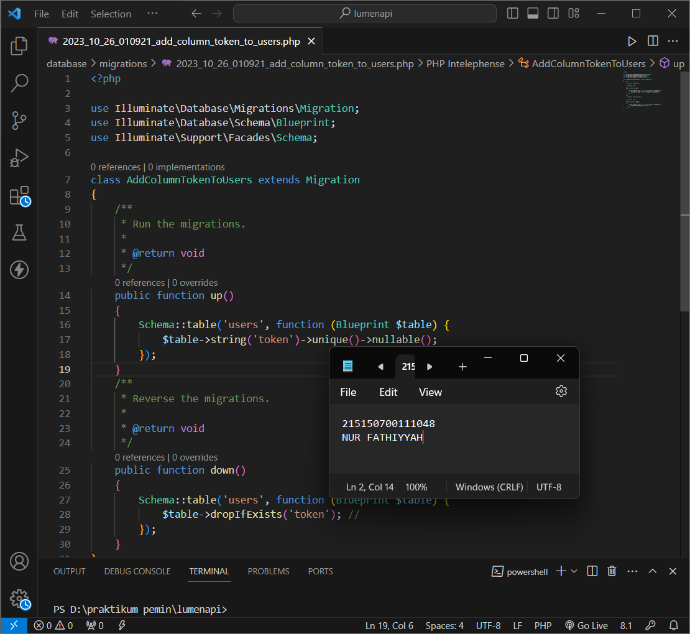
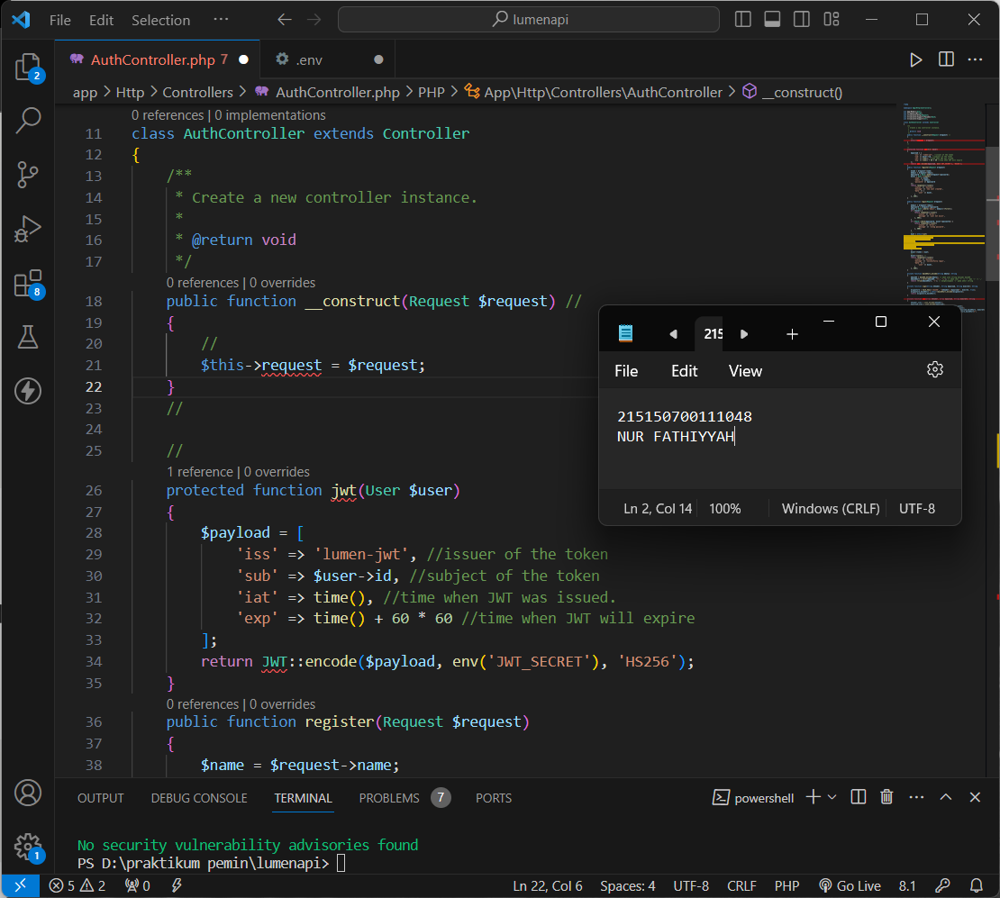

# Modul 8 - JSON Web Token (JWT)

## Penyesuaian Database

- ### Langkah 1

  Melakukan perubahan pada length kolom token dengan menghapus parameter 72 di belakangnya
  

- ### Langkah 2

  Menjalankan perintah `php artisan migrate:fresh` untuk memperbaharui migrasi dan menghapus data yang lama
  

- ### Langkah 3

  Menjalankan aplikasi pada endpoint /auth/register dengan body seperti pada gambar
  

## JWT Manual

- ### Langkah 4

  Menambahkan ketiga fungsi berikut pada AuthController.php
  

- ### Langkah 5

  Melakukan perubahan pada fungsi login
  

- ### Langkah 6

  Menambahkan 4 fungsi baru (base64ur1_encode, base64ur1_decode, sign, dan verify) pada Middleware/Authorization.php
  

- ### Langkah 7

  Melakukan perubahan pada fungsi handle
  

- ### Langkah 8

  Menjalankan aplikasi pada endpoint /auth/login dengan body seperti pada gambar
  

- ### Langkah 9

  Menjalankan aplikasi pada endpoint /home dengan melampirkan nilai token yang didapat pada login sebelumnya
  

## JWT Library

- ### Langkah 10

  Melakukan generate jwt key secara online menggunakan website Djecrety ― Django Secret Key Generator
  

- ### Langkah 11

  Memasukkan secret key tersebut pada file .env dengan membuat variable baru bernama `JWT_SECRET`
  

- ### Langkah 12

  Melakukan instalasi package jwt firebase dengan menggunakan command seperti pada gambar
  

- ### Langkah 13

  Menambahkan fungsi baru pada file AuthController
  

- ### Langkah 14

  Melakukan perubahan pada fungsi login
  

- ### Langkah 15

  Membuat file JwtMiddleware.php dan menambahkan baris kode seperti pada gambar
  

- ### Langkah 16

  Mendaftarkan middleware yang telah dibuat pada bootstrap/app.php
  

- ### Langkah 17

  Menambahkan baris kode untuk rute middleware home pada routes/web.php
  

- ### Langkah 18

  Menjalankan aplikasi pada endpoint /auth/login dengan body seperti pada gambar
  
